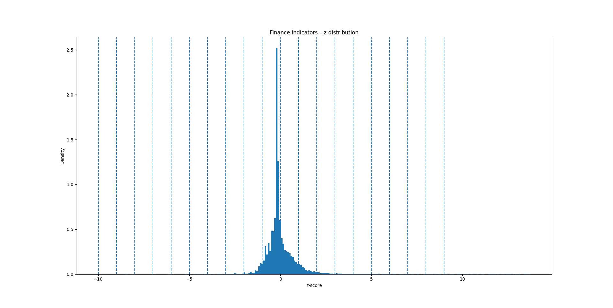
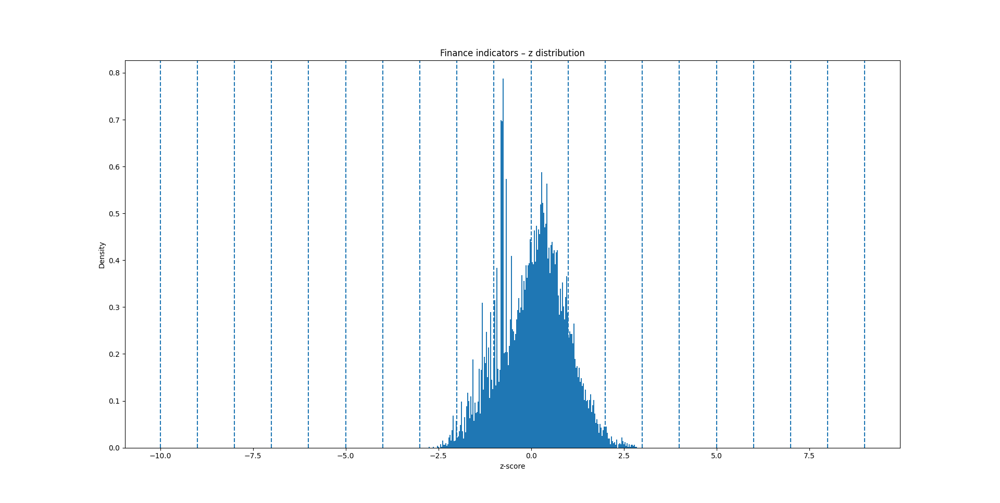
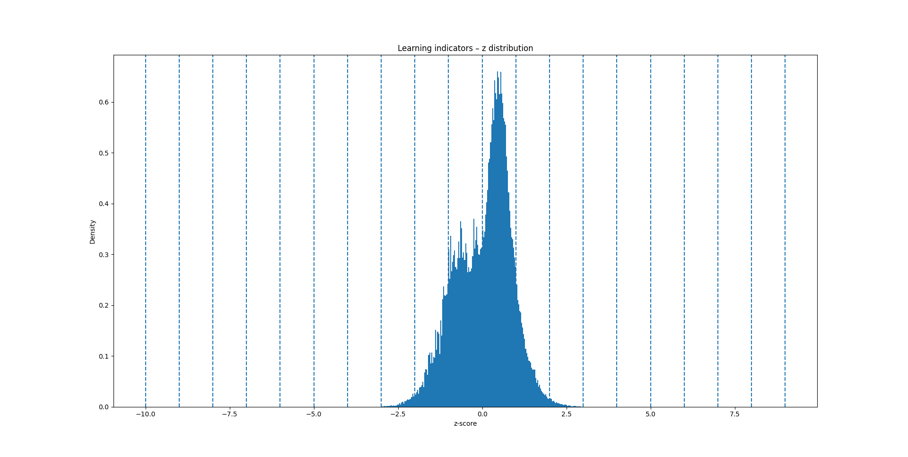
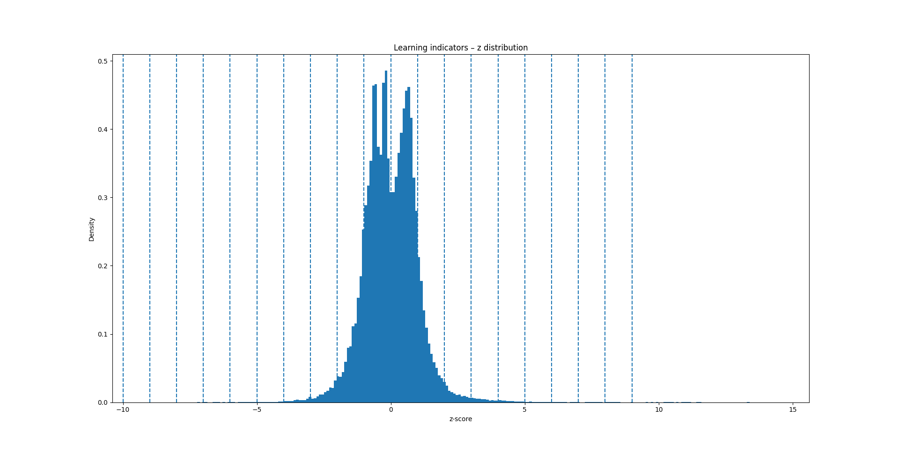
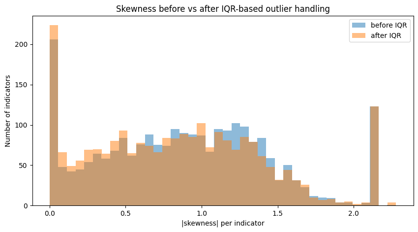
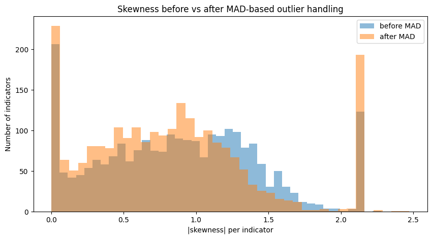
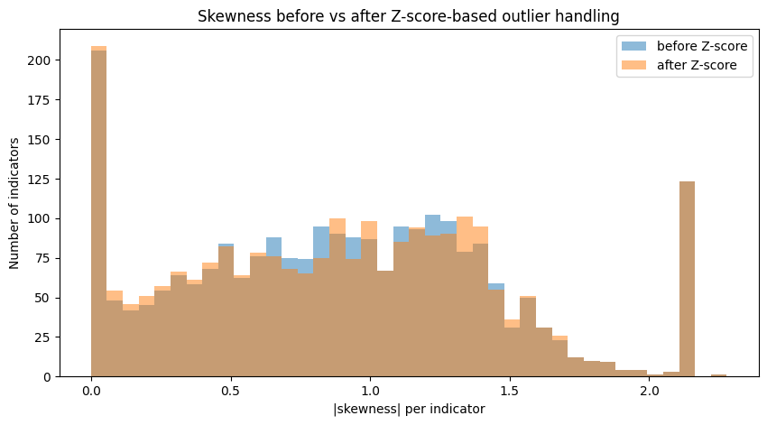

<table border="0">
 <tr>
    <td></td>
    <td>
      <p>Universiteti i Prishtinës</p>
      <p>Fakulteti i Inxhinierisë Elektrike dhe Kompjuterike</p>
      <p>Inxhinieri Kompjuterike dhe Softuerike - Programi Master</p>
      <p>Profesori: Dr. Sc. Mërgim H. HOTI</p>
      <p>Lënda: Përgatitja dhe vizualizimi i të dhënave</p>
    </td>
 </tr>
</table>

# Education Statistics — Data Preparation & Visualization (EdStats / World Bank)

## Overview

This repository contains the coursework for the university subject **Përgatitja dhe vizualizimi i të dhënave** (*Data Preparation and Visualization*).

It works with the **World Bank EdStats** dataset (CSV), which includes hundreds of education indicators for countries worldwide. Across **two phases**, we apply the full lifecycle of data preparation and analytic engineering to produce **meaningful, presentation-ready insights**.

Phase 1 builds three analytical pipelines:

- **Pipeline A – Education Investment & Efficiency**
  - Constructs an **Education Investment Indicator (EII)** and an **OUTCOME** composite (learning results).
  - Builds an **Efficiency** index that relates learning outcomes to levels of investment, for **countries, regions, income groups, and lending groups**.

- **Pipeline B – Gender Gap & Population Learning Performance**
  - Measures **gender gaps** in learning outcomes (boys vs girls).
  - Builds a scale-free **gender gap index** and a **population learning performance index** using learning-related indicators across **1970–2023**.

- **Pipeline C – Kosovo Urban–Rural Gap & Trend Analysis**
  - Focuses only on **Kosovo**.
  - Analyses **urban vs rural** differences for learning indicators.
  - Computes **recent trends** (slopes) for key indicators.

Phase 2 extends the same data with:

- **Data exploration and multivariate summary statistics**  
  (per country, region, income group, URBAN/RURAL, and indicator families).
- **Outlier detection and correction**  
  (univariate and multivariate) so extreme or implausible values do not distort indices and trends.
- **Skewness detection and correction**  
  (for example, log-based and other monotonic transformations) to stabilise highly skewed indicators and make standardisation (z-scores) more meaningful.

The project explicitly exercises the core topics of the course:

- data collection, **type definition**, and **data quality**  
- **integration**, aggregation, sampling, cleaning, **missing-value** identification and treatment  
- **dimensionality reduction**, feature subset selection, **feature creation**, discretization & binarization, transformation  
- and in **Phase 2**: outlier analysis and skewness-aware transformations.

---

## Technical Details

### Project topology & pipeline conventions (high-level)

The repository is organized as a **tree of modular stages**. Each top-level stage is numbered, and sub-stages use lettered suffixes to convey ordering and dependencies. Conceptually:

```text
1A_attributes_reordering/
1B_type_definitions/
1BA_attribute_distinct_values/
1C_data_quality_cleaning/
1CA_attributes_distinct_values_quality_check/

2A_data_missing_values_handling/
2B_data_cleaning/

3A_integrate_with_class/

4A_kosova_specific_indicators/
4A_kosova_specific_pipeline/

4BA_transformation_unpivot/
4BB_aggregation_window/
4BC_dimesion_reduction/
4BD_normalization/
4BE_attribute_creation_subset/
4BF_discretization_binarization/

4CB_aggregation_gender_learning/
4CC_aggregation_gender_learning_zscore/
4CCB_discretization_binarization_M_F/

4CD_aggregation_country_learning_population_zscore/
4CDD_discretization_binarization_population/

5B_education_investement_on_outcome_efficiency_result/
```

Some important conventions:

- **Modular** – every stage is independently runnable and writes its own outputs, so you can work anywhere in the pipeline without rerunning everything.
- **Reproducible** – intermediate outputs are **stage-versioned**; downstream steps depend only on the prior stage’s output folder.
- **Flexible** – we use **Python** and **PySpark** for transformation because of their **power, scalability, and expressiveness** on messy, wide, time-series-like datasets.


---

### Phase 1 – Detailed pipeline description

Phase 1 is common for the whole project and then branches into **three analytical pipelines**. All pipelines share the same preprocessing up to integration (Stages 1–3) and reuse the same normalization and transformation logic where possible.

---

#### 1. Common preprocessing (Stages 1–3, shared by all pipelines)

These scripts prepare a **clean, integrated, time-series dataset** that all three pipelines reuse.

- **1A – Attribute reordering** (`1A_attributes_reordering.py`)  
  Reorders the EdStats CSV so that **non-year attributes come first**, followed by all `YR####` columns in ascending order.  
  This makes year ranges easier to handle and prepares the dataset for wide-to-long transformations.

- **1B – Type definitions** (`1B_type_definitions.py`)  
  Centralizes **schema definitions** used across later stages:
  - logical schemas for the “wide” EdStats table,
  - “long” schema for `(Year, Value)` pairs,
  - schemas for normalized/z-scored outputs.  
  This ensures consistent types for country codes, indicators, units, and numeric values.

- **1BA – Distinct value profiling (before cleaning)** (`1BA_attribute_distinct_values.py`)  
  For every **non-year attribute column** (e.g. `economy`, `SEX`, `URBANIZATION`, etc.), saves a small CSV with **distinct values**.  
  Used to:
  - understand raw domains of categorical variables,
  - support manual data quality rules.

- **1C – Data quality cleaning** (`1C_data_quality_cleaning.py`)  
  Applies **domain rules** and an `is_valid` flag:
  - normalizes odd URBANIZATION codes (e.g. collapsing noisy variants into `URB`, `RUR`, `_T`, `NA`),
  - validates that `economy` is a 3-letter code,
  - restricts `SEX` and `URBANIZATION` to allowed values (`M`, `F`, `_T`, `NA` and `URB`, `RUR`, `_T`, `NA`),
  - rows with invalid or inconsistent codes are marked `is_valid = False`.

- **1CA – Distinct values after quality rules** (`1CA_attributes_distinct_values_quality_check.py`)  
  Recomputes distinct values for all non-year attributes **after** the cleaning step, to verify that:
  - invalid codes were removed or normalized,
  - the cleaned domains match expectations.

- **2A – Missing-values handling** (`2A_data_missing_values_handling.py`)  
  - Converts string `"NA"` markers into real nulls.
  - Drops rows where **all** year values are null (no time-series information).
  - Removes year columns that are entirely empty.
  - Keeps `is_valid` and reorders columns as `[non-year] + [year] + is_valid`.  
  This ensures that later statistics are not polluted by purely missing rows/columns.

- **2B – Data cleaning** (`2B_data_cleaning.py`)  
  - Keeps only rows with `is_valid = True`.
  - Removes duplicate records.
  - Writes a **clean base table** used by subsequent integration.

- **3A – Integration with classification metadata** (`3A_integrate_with_class.py`)  
  Joins the cleaned EdStats time-series with a **CLASS** file that provides `Region`, `Income group`, and `Lending category` per country:
  - normalizes country codes (upper-case, trimmed),
  - performs a left join on the 3-letter economy code,
  - reorders columns so that original EdStats attributes come first, followed by classification attributes and `YR####` columns.  

At this point, we have a **single, integrated, quality-checked time-series dataset** that all three pipelines reuse.

---

#### 2. Pipeline A – Education investment, outcomes & efficiency

**Key question:**  
> *How efficiently do countries turn educational investment into learning outcomes?*

Scripts:

- `4BA_transformation_unpivot.py`
- `4BB_aggregation_window.py`
- `4BC_dimesion_reduction.py`
- `4BD_normalization.py`
- `4BE_attribute_creation_subset.py`
- `4BF_discretization_binarization.py`
- `5B_education_investement_on_outcome_efficiency_result.py`

Stages:

1. **4BA – Transformation to long format**  
   - Converts the wide matrix of `YR####` columns into a **long** table with columns `(…, Year, Value)`.
   - Drops rows where `Value` is null.

2. **4BB – Latest / window-based aggregation**  
   - For each `(economy, INDICATOR)` pair, uses a **window over years**:
     - typically keeps the **most recent non-null year** per indicator and economy,
     - optionally supports small time windows if needed.
   - Produces a “latest known value” snapshot for each indicator and country.

3. **4BC – Dimension reduction (indicator family selection)**  
   - Splits indicators into thematic families using regex filters over `Indicator name` / codes:
     - **Finance** (expenditure, spending, % of GDP, per-student, government).
     - **Learning** (achievement scores, test results, learning-adjusted years, proficiency levels, etc.).
   - This reduces the very wide EdStats universe to **two focused indicator sets**:
     - investment-related,
     - outcome-related.

4. **4BD – Normalisation to z-scores**  
   For each indicator separately:

   - Transforms raw `Value` into a pre-normalized `val_std`:
     - when `UNIT_MEASURE = "NUMBER"` → uses `log1p(Value)` (handles heavy-tailed amounts),
     - when `UNIT_MEASURE = "SHARE"` and values are > 1 → scales by dividing by 100,
     - otherwise keeps the value as is.
   - Computes **mean μ and standard deviation σ per indicator** and outputs a **z-score**:

     $$
     z = \frac{val\_std - \mu}{\sigma}
     $$

   - Handles degenerate cases (σ = 0 or null) with safe fallbacks.

5. **4BE – Composite indices (EII & OUTCOME) and efficiency**  
   - Aggregates **finance z-scores** by `(economy, Country name, Region, Income group, Lending category)`:
     - builds **EII_z** (Education Investment Indicator),
     - tracks `k_fin` (how many finance indicators contributed).
   - Aggregates **learning z-scores** per `economy`:
     - builds **OUTCOME_z**,
     - tracks `k_out`.
   - Joins both into one table and shifts the EII index to be strictly positive:

     $$
     EII_{pos} = EII_z - \min(EII_z) + 1
     $$

   - Defines **Efficiency**:

     $$
     Efficiency = \frac{OUTCOME_z}{EII_{pos}}
     $$

6. **4BF – Discretization & binarization**  
   - Uses a **quantile-based discretizer** (e.g. tertiles) to assign bands:
     - `EII_z_band`, `OUTCOME_z_band`, `Efficiency_band` (e.g. Low / Medium / High).
   - Creates binary flags:
     - `EII_high`, `OUTCOME_high`, `Efficiency_high` = 1 if country is in the **top tertile**.
   - Sorts countries by **Efficiency** and prepares them for ranking and visualization.

7. **5B – Result tables for countries / regions / income / lending**  
   Produces final summary tables used in the report/visualizations:

   - For **Country name**, **Region**, **Income group**, **Lending category**:
     - number of contributing indicators (`n`),
     - average `EII_z`, `OUTCOME_z`, `Efficiency`,
     - proportion of countries with high EII/OUTCOME/Efficiency.  

This pipeline demonstrates **aggregation**, **composite index construction**, **discretization & binarization**, and building **result-ready tables**.

---

#### 3. Pipeline B – Gender gap & population learning performance

**Key question:**  
> *How large are gender gaps in learning indicators, and how does overall (population) performance look?*

Scripts:

- `4CB_aggregation_gender_learning.py`
- `4CC_aggregation_gender_learning_zscore.py`
- `4CCB_discretization_binarization_M_F.py`
- `4CD_aggregation_country_learning_population_zscore.py`
- `4CDD_discretization_binarization_population.py`

Stages:

1. **4CB – Aggregation by gender and learning root**  
   - Starts from the learning indicator subset and converts it to a **long format** for years 1970–2023.
   - Filters to `SEX ∈ {M, F}` and keeps reasonable numeric ranges.
   - For each `(Country name, INDICATOR_ROOT, SEX)`:
     - computes the **mean value** across available years.
   - Pivots to have **M** and **F** side by side, then aggregates to country level:
     - computes raw gender gap metrics, e.g. `diff_abs_F_M`.

2. **4CC – Gender gap on standardized (z-score) scale**  
   - Repeats the aggregation but using **z-scores instead of raw values**:
     - applies the same transformation logic as 4BD (log/scale),
     - standardizes per indicator, then aggregates to **INDICATOR_ROOT**, then by country and gender.
   - Produces **`diff_abs_F_M_z`**, a **scale-free gender gap index per country**.

3. **4CCB – Discretization & binarization of gender gaps**  
   - Categorizes each country into qualitative gap categories, e.g.:
     - `Very small`, `Moderate`, `Large`, `Very large` based on `diff_abs_F_M_z` thresholds.
   - Adds `gap_binary_high` = 1 when the gender gap is at least moderate.

4. **4CD – Population mean learning performance**  
   - Standardizes learning indicators for all sexes (`M`, `F`, `_T`).
   - Aggregates by `(Country name, INDICATOR_ROOT, SEX)` to get **root-level z-scores**.
   - Combines genders to obtain a **population mean root z-score**, then averages over roots to get `avg_all_indicators_population_z` per country.

5. **4CDD – Discretization & binarization of population performance**  
   - Maps population z-scores to qualitative performance categories:
     - `Very low`, `Low`, `Moderate`, `High`, `Very high`.
   - Adds `performance_binary` = 1 for countries with non-negative average population z-score.  

This pipeline demonstrates **multi-group aggregation (by sex)**, **equity-oriented feature creation (gaps)**, and discretization for **policy-friendly summaries**.

---

#### 4. Pipeline C – Kosovo urban–rural gap & trend analysis

**Key question:**  
> *How does Kosovo perform on learning indicators, and how large are the urban–rural gaps and recent trends?*

Scripts:

- `4A_kosova_specific_indicators.py`
- `4A_kosova_specific_pipeline.py`

Stages:

1. **Kosovo indicators shortlist** (`4A_kosova_specific_indicators.py`)  
   - Filters the integrated dataset for rows where `economy = "XKX"` or `Country name = "Kosovo"`.
   - Exports a clean list of `(INDICATOR, Indicator name, name)` for **manual selection** of relevant learning indicators for Kosovo.

2. **Kosovo-specific pipeline** (`4A_kosova_specific_pipeline.py`)  

   Using the long-format data and selected indicators, it performs:

   - **Urban–rural gap construction**:
     - Filters indicators related to literacy, reading, maths, science, proficiency, tests, etc.
     - Normalizes different encodings of urban/rural (indicator codes, names, URBANIZATION) into a simple label `URB_LBL ∈ {U, R}`.
     - Pivots to have columns `U` and `R` per `(IND_BASE, NAME_BASE, Year)` and computes:
       - `gap_U_minus_R = U − R` and `abs_gap_urb = |gap_U_minus_R|`.
       - Percentage-point versions, making gaps easily interpretable.  
       This yields a table of **urban–rural learning gaps for Kosovo**, sorted by largest gap.

   - **Recent trend slopes**:
     - For each selected indicator, keeps the last N years where Kosovo has data (e.g. last 10 years).
     - Computes a **slope per year** using covariance and variance of `(Year, Value)`:
       - slope ≈ “average yearly change”.
     - Produces a ranked list showing which Kosovo indicators are **improving** or **deteriorating** fastest.

This pipeline demonstrates **country-specific slicing**, **equity analysis by URBANIZATION**, and simple **time-series trend estimation**.

---

### How course requirements are fulfilled (mapped to the pipelines)

- **Data collection, type definition, data quality**  
  - Central schema definitions and typing (`1B_type_definitions.py`) plus quality rules (`1C_data_quality_cleaning.py`, `2B_data_cleaning.py`) ensure clean domains for keys and categorical attributes.
  - Distinct-value profiling before and after cleaning (`1BA_attribute_distinct_values.py`, `1CA_attributes_distinct_values_quality_check.py`) documents the real codes used in the raw EdStats file.

- **Integration, aggregation, sampling, cleaning, missing values**  
  - Integration with country metadata (`3A_integrate_with_class.py`) and systematic missing-value pruning (`2A_data_missing_values_handling.py`) prepare an analysis-ready panel.
  - Pipelines A–C perform different aggregations:
    - latest snapshots (`4BB_aggregation_window.py`),
    - country-level indices (`4BE_attribute_creation_subset.py`, `5B_education_investement_on_outcome_efficiency_result.py`),
    - gender-root and population-level statistics (`4CB_aggregation_gender_learning.py`, `4CC_aggregation_gender_learning_zscore.py`, `4CD_aggregation_country_learning_population_zscore.py`),
    - and Kosovo-specific gaps/trends (`4A_kosova_specific_pipeline.py`).

- **Dimensionality reduction & feature / subset selection**  
  - The dimension-reduction step (`4BC_dimesion_reduction.py`) selects only finance and learning-quality proxies from the wide EdStats indicator universe.
  - Later pipelines further restrict to learning-gap indicators (gender) or Kosovo literacy/test indicators.

- **Feature creation (indices, gaps, trends)**  
  - EII_z, OUTCOME_z, and **Efficiency** (Pipeline A).
  - Gender gap measures `diff_abs_F_M` and `diff_abs_F_M_z`, population performance indices (Pipeline B).
  - Urban–rural gaps and trend slopes for Kosovo (Pipeline C).

- **Discretization & binarization**  
  - Tertile bands and binary “high” flags for EII, OUTCOME, and Efficiency (`4BF_discretization_binarization.py`).
  - Category labels and binary flags for gender gaps (`4CCB_discretization_binarization_M_F.py`) and population performance (`4CDD_discretization_binarization_population.py`).

- **Transformation (normalisation, log/scale, z-scores)**  
  - Log-plus-one transformations for amounts (`NUMBER` units), percentage scaling for `SHARE` units, and per-indicator z-scores in `4BD_normalization.py`, reused in gender/population pipelines.
  - Phase 2 will extend this with **skewness-driven transformations**, guided by summary statistics and distribution diagnostics.

---

### Phase 2 – Outlier and skewness analysis

Phase 2 reuses the Phase 1 pipelines but rebuilds them on a dataset where suspicious values are explicitly detected, inspected and handled. It focuses on three course requirements:

- outlier detection and handling (not always hard deletion),
- elimination of clearly inaccurate findings,
- exploratory analysis of distributions and skewness (univariate and multivariate).

Phase 2 is organised similarly to Phase 1:

1. Shared preprocessing stages (1A–3B) that turn the cleaned EdStats panel into an outlier-aware long-format dataset.
2. An outlier-aware **Education Investment & Efficiency** pipeline (3BC–4B), which recalculates EII, OUTCOME and Efficiency after trimming extreme finance/learning values.
3. A **Gender gap & population learning** pipeline with three alternative outlier strategies (z-score, IQR and MAD) and skewness diagnostics for each.

---

#### 1. Shared preprocessing for outlier-aware analysis (Stages 1–3)

These stages start from the Phase 1 reordered file and add rule-based flags and structural checks focused on outliers.

- **1A – Categorical outlier exploration** (`1A_categorical_outliers_distinct_values.py`, `1AA_categorial_outliers_identification.py`)  
  Recomputes distinct values for every non-year attribute on the Phase 2 copy of the dataset and isolates rows containing obviously corrupted codes or free-text fragments in categorical fields (for example survey question text in `SEX`, broken economy codes or stray `URBANIZATION` labels). These examples document qualitative outliers that cannot be detected numerically.

- **1B – Rule-based outlier flagging** (`1B_rule_based_outliers_flagging.py`)  
  Normalises rare but fixable codes (for example `RURURUR → RUR`) and validates the length and domain of key identifiers (`economy`, `SEX`, `URBANIZATION`). Rows that fall outside the allowed domain get a Boolean `is_outlier` flag, while the row itself is still preserved for inspection.

- **1C – Empty / sparse outlier removal** (`1C_empty_sparse_outliers_removal.py`)  
  Converts string `"NA"` markers to real nulls and drops rows that are completely empty across all year columns. Removes year columns that are entirely null and moves `is_outlier` to the end of the schema so it is easy to track.

- **1D – Outlier pruning and deduplication** (`1D_outliers_cleaned.py`)  
  Retains only rows where `is_outlier = False`, then removes exact duplicate records. This yields a wide EdStats panel where categorical outliers and structurally invalid rows have been removed.

- **2A – Re-enrichment with classification metadata** (`2A_data_enrichment_with_class.py`)  
  Joins the outlier-cleaned table with the CLASS file to add `Region`, `Income group` and `Lending category`, mirroring Phase 1 but with the cleaner base.

- **3BA – Transformation to long format (outlier-aware)** (`3BA_transformation_unpivot.py`)  
  Unpivots all year columns `YR1960–YR2029` into `(Year, Value)` pairs on the outlier-filtered dataset and discards null values.

- **3BB – Latest-value aggregation** (`3BB_aggregation_window.py`)  
  For each `(economy, INDICATOR)` keeps only the latest non-null observation and discards earlier years. This produces a single “current” value per indicator and economy, which is the starting point for all Phase 2 numeric diagnostics.

- **3BC – Dimension reduction (finance vs learning, reused)** (`3BC_dimension_reduction.py`)  
  Same idea as in Phase 1, but now applied to the outlier-filtered latest snapshot:  
  - `3BCA_dimension_reduction_filtered_finance.csv` for expenditure and investment indicators.  
  - `3BCB_dimension_reduction_filtered_learning.csv` for learning quality and attainment indicators.

The remaining stages split into the two analytic pipelines below.

---

#### 2. Pipeline A (Phase 2) – Outlier-aware education investment & efficiency

**Goal:** Rebuild the **Education Investment Indicator (EII)**, **OUTCOME** composite and **Efficiency** index on a dataset where extreme finance and learning values have been treated using a combination of z-scores and IQR rules, and evaluate how this changes the shape of the distributions.

**Stages and methods**

- **3BD – Normalisation, outlier identification and elimination** (`3BD_transformation_normalization.py`)  
  For both finance and learning subsets:
  - applies unit-aware pre-transformations:  
    - `NUMBER` units → `log1p(Value)` to compress heavy tails;  
    - `SHARE` units greater than 1 → divided by 100 to map percentages into `[0, 1]`;  
  - computes per-indicator mean `μ`, standard deviation `σ` and z-score `z = (val_std − μ) / σ`;  
  - flags **z-score outliers** where `|z| > 3`;  
  - computes IQR fences per indicator and flags **IQR outliers** where the transformed value falls outside `[Q1 − 1.5·IQR, Q3 + 1.5·IQR]`;  
  - drops rows where either flag is true, combining parametric (z-score) and robust (IQR) filters.

  Trimmed and normalised tables for finance and learning indicators are then used to recompute EII and OUTCOME. In an intermediate exploratory version, the script also plots z-score histograms for finance and learning before and after trimming. These figures show that the bulk of indicators become closer to a bell-shaped distribution once extreme tails are removed, which supports the use of z-scores in the later index.

- **3BE – Rebuilding EII, OUTCOME and Efficiency on cleaned data** (`3BE_attribute_creation_subset.py`)  
  Aggregates normalised finance z-scores by `(economy, Country name, Region, Income group, Lending category)` to compute `EII_z` and the number of contributing finance indicators `k_fin`. Aggregates learning z-scores by economy to compute `OUTCOME_z` and `k_out`. Both parts are joined and `EII_pos = EII_z − min(EII_z) + 1` is recomputed, followed by `Efficiency = OUTCOME_z / EII_pos` on the outlier-trimmed sample. This allows direct comparison with the Phase 1 Efficiency index and answers how sensitive the ranking is to extreme observations.

- **3BF – Discretisation and binarisation on the outlier-cleaned indices** (`3BF_discretization_binarization.py`)  
  Uses `QuantileDiscretizer` to split `EII_z`, `OUTCOME_z` and `Efficiency` into three bands (low / medium / high) based on empirical quantiles and generates binary flags `*_high` for the top band only.

- **4B – Final efficiency tables (countries, regions, income, lending)** (`4B_education_investement_on_outcome_efficiency_result.py`)  
  Aggregates the binarised indices by `Country name`, `Region`, `Income group` and `Lending category`, computing counts of observations, average EII / OUTCOME / Efficiency and shares of units with high values. These are the Phase 2 efficiency results, comparable with Phase 1 but based on a dataset where implausible finance and learning values have been filtered out and skewness has been reduced.

The finance and learning before/after figures included in the report illustrate how much the tails shrink after outlier removal and how the core of the distribution becomes more symmetric, especially for finance indicators.



*Finance indicators after outlier skewness handling*



*Finance indicator after outlier skewness handling*



*Learning indicators pre outlier skewness handling*



*Learning indicators after outlier skewness handling*

---

#### 3. Pipeline B (Phase 2) – Gender gaps, population learning and skewness-aware methods

**Goal:** Examine how different outlier and skewness-handling strategies (z-score, IQR, MAD) affect:

- gender gaps in learning performance,
- population-level learning indices,
- overall skewness in learning indicators.

This pipeline operates only on the learning indicators subset.

##### 3.1 Learning indicator selection and skewness diagnostics

- **3CA – Learning indicator shortlist** (`3CA_check_learning_roots.py`)  
  Filters the integrated dataset to keep only indicators that match a curated whitelist of codes and substrings corresponding to learning outcomes (test scores, proficiency, LAYS, HCI and similar), while dropping known non-learning patterns. The output `learning_indicators_only` is a wide table restricted to learning measures.

- **3CAA – Skewness diagnostics per indicator** (`3CAA_skewness_diagnostics.py`)  
  Converts the wide table into a long format for years 1970–2023 and computes, per `INDICATOR`, mean, median and standard deviation of `Value` together with Pearson’s second skewness `skew_pearson = 3 (mean − median) / sd`. Indicators are assigned to qualitative skewness bands (`nearly_symmetric`, `moderately_skewed`, `highly_skewed`, `very_highly_skewed`) and each band is mapped to a preferred outlier method (z-score, IQR or MAD). Global diagnostics (mean skewness, mean |skewness|, dominant category and method) satisfy the summary statistics and multivariate EDA requirement and motivate the robust methods used later.

##### 3.2 Gender gaps with three outlier strategies

Each of the following scripts reshapes the data to long form, normalises values by unit type, filters to valid countries and non-negative values, harmonises `SEX` into `M` / `F`, then aggregates first to indicator roots and finally to country level. The difference lies in how outliers and skewness are handled:

- **Z-score based gender gaps** (`3CB_aggregation_gender_learning_zscore.py`)  
  Computes classic z-scores per indicator using window functions, trims observations with `|z| > 3`, aggregates to `root_mean_z` per `(Country, INDICATOR_ROOT, SEX_NORM)` and then to country-level gender differences `diff_abs_F_M_z` on the average of roots.

- **IQR-based gender gaps** (`3CC_aggregation_gender_learning_iqr.py`)  
  Computes per-indicator `Q1`, `Q3` and `IQR`, removes observations outside `[Q1 − 1.5·IQR, Q3 + 1.5·IQR]`, aggregates to `root_mean_iqr` and then to country-level `diff_abs_F_M_iqr`.

- **MAD-based (robust) gender gaps** (`3CD_aggregation_gender_learning_mad.py`)  
  Computes per-indicator medians and median absolute deviation (MAD), calculates robust z-scores `z_robust = (val_std − median) / (1.4826 · MAD)` and trims observations with `|z_robust| > 3.5`. Aggregates to `root_mean_mad` and country-level `diff_abs_F_M_mad`, which is less sensitive to extreme values and heavy tails.

- **3CDA – Discretisation and binarisation of MAD-based gender gaps** (`3CDA_discretization_binarization_gender_mad.py`)  
  Categorises `diff_abs_F_M_mad` into qualitative gap bands (`Very small`, `Small`, `Moderate`, `Very large`) and defines a binary flag `gap_binary_high_mad` for moderate-or-higher gaps.

Together, these scripts allow direct comparison of how z-score, IQR and MAD trimming affect the magnitude and classification of gender gaps.

##### 3.3 Population learning indices with MAD

For population performance we focus on the MAD-based approach, which is the most robust in the skewness diagnostics:

- **3CE – Population learning (MAD)** (`3CE_aggregation_population_learning_mad.py`)  
  Normalises values, harmonises `SEX` into `M`, `F`, `T` (total), computes MAD-based robust z-scores per indicator and removes `|z_robust| > 3.5` outliers. Aggregates to `pop_mean_root_mad` per `(Country, INDICATOR_ROOT)` by combining total and male/female information, then averages across roots to obtain `avg_all_indicators_population_mad` and the number of roots used per country.

- **3CEA – Discretisation and binarisation of population performance (MAD)** (`3CEA_discretization_binarization_population_mad.py`)  
  Maps `avg_all_indicators_population_mad` into five ordered categories (`Very low`, `Low`, `Moderate`, `High`, `Very high`) using symmetric cut-points around 0, and adds a binary flag `performance_binary_mad` for non-negative performance.

##### 3.4 Skewness before/after plots for each method

The three scripts in `skewness_analysis/` provide global visual diagnostics:

- **3C_mad_skewness_before_after.py** – computes skewness per indicator before and after MAD-based outlier removal, prints summary statistics (mean |skewness| and number of indicators that improve) and saves a histogram comparing `|skew|` distributions for MAD.
- **3C_zscore_skewness_before_after.py** – same for the z-score based trimming.
- **3C_iqr_skewness_before_after.py** – same for the IQR-based trimming.

These plots visually show which method reduces skewness the most and how aggressive each is in removing observations, directly addressing the skewness detection and correction requirement.



*IQR skewness before and after handling*



*MAD skewness before and after handling*



*Z-score skewness before and after handling*

---

#### 4. Relation to the three analytical pipelines

- **Education Investment & Efficiency (Pipeline A)**  
  Phase 2 results reuse the Phase 1 pipeline structure but replace the input with outlier-filtered, skewness-stabilised z-scores (Section 2). This ensures that the Efficiency rankings are driven by systematic patterns rather than a few extreme observations.

- **Gender Gap & Population Learning Performance (Pipeline B)**  
  Phase 2 introduces three alternative outlier and skewness strategies and compares them quantitatively and visually (Section 3), demonstrating trade-offs between robustness and information retention.

- **Kosovo Urban–Rural Gap & Trend Analysis (Pipeline C)**  
  Uses the same outlier-aware learning indicators as input; although no new Phase 2 code is added for Kosovo specifically, the results now inherit the cleaner, less skewed distributions produced by the Phase 2 preprocessing.

---

### How course requirements are fulfilled – Phase 2 (outliers, skewness, EDA)

- **Outlier detection, handling and elimination of incorrect findings**  
  - Categorical / structural outliers are detected and cleaned in  
    `1A_categorical_outliers_distinct_values.py`,  
    `1AA_categorial_outliers_identification.py`,  
    `1B_rule_based_outliers_flagging.py`,  
    `1C_empty_and_sparse_outliers_removal.py`, and  
    `1D_outliers_removal_and_deduplication.py`.  
    These scripts identify invalid `economy`, `SEX`, `URBANIZATION` values and empty rows, flag them
    as `is_outlier`, and finally remove them before numerical analysis.  
  - Numeric outliers for **finance and learning** (Efficiency pipeline) are detected and trimmed in  
    `3BD_normalized_outlier_identification_elimination.py`, which combines:
    - z-score based detection (`|z| > 3`) after unit-aware normalisation, and  
    - IQR-based detection (`[Q1 − 1.5·IQR, Q3 + 1.5·IQR]`).  
    The cleaned values feed into `3BE_attribute_creation_subset.py`, `3BF_discretization_binarization.py`
    and `4B_education_investement_on_outcome_efficiency_result.py` to rebuild EII, OUTCOME and
    Efficiency on an outlier-filtered sample.  
  - For **gender gaps and population learning** (Pipeline B), numeric outliers are handled with three
    alternative methods:  
    z-score (`3CB_aggregation_gender_learning_zscore.py`),  
    IQR (`3CC_aggregation_gender_learning_iqr.py`), and  
    MAD (`3CD_aggregation_gender_learning_mad.py`, `3CE_aggregation_population_learning_mad.py`).  
    This directly addresses the requirement for systematic outlier detection and handling, not just
    ad-hoc deletion.

- **Exploration of data – statistical summary and multivariate view**  
  - `3CAA_skewness_diagnostics.py` computes per-indicator summary statistics (mean, median, standard
    deviation, skewness) for learning indicators over 1970–2023 and groups them into skewness
    categories. This is the main **univariate statistical summary** module for Phase 2.  
  - `3BDA_normal_distribution_visualisation_graph.py` generates density plots / histograms of
    normalised finance and learning z-scores **before and after** outlier removal, giving a global,
    cross-indicator view of how the distributions change (multivariate EDA over many indicators).  
  - The comparison scripts `3C_mad_skewness_before_after.py`,  
    `3C_zscore_skewness_before_after.py`, and  
    `3C_iqr_skewness_before_after.py` aggregate skewness measures across all learning indicators and
    plot “before vs after” histograms. These provide a **multivariate** perspective on how each
    method affects the whole indicator set, not only individual variables.

- **Skewness detection and correction**  
  - Skewness is **measured** in `3CAA_skewness_diagnostics.py` using Pearson skewness per indicator,
    and each indicator is assigned to a skewness band. This diagnostic guides which method
    (z-score, IQR, MAD) is more appropriate for each family of indicators.  
  - Skewness is **corrected** in several ways:
    - `3BD_normalized_outlier_identification_elimination.py` applies `log1p` to `NUMBER` units and
      rescales `SHARE` units to `[0, 1]` before z-scoring, which reduces right-skewness in strongly
      heavy-tailed indicators.  
    - The outlier-trimming steps in `3BD_normalized_outlier_identification_elimination.py`,
      `3CB_aggregation_gender_learning_zscore.py`, `3CC_aggregation_gender_learning_iqr.py`,
      `3CD_aggregation_gender_learning_mad.py`, and `3CE_aggregation_population_learning_mad.py`
      remove extreme tails that drive high skewness.  
  - `3C_mad_skewness_before_after.py`, `3C_zscore_skewness_before_after.py`, and
    `3C_iqr_skewness_before_after.py` then **quantify and visualise** how much |skewness| is reduced
    by each method, showing that robust approaches (IQR, MAD) generally produce more symmetric
    distributions than raw z-score trimming.

---

## How to Run

### Requirements

- **Python 3.10+** (recommended)
- **PySpark**
- **NumPy**
- (Optional but recommended) **Java 11+** for local Spark runs

Install dependencies (example using `venv`):

```bash
python -m venv .venv
source .venv/bin/activate        # On Windows: .venv\Scripts\activate
pip install pyspark numpy
```

---

## Contributors

- [Fatjeta Gashi](https://github.com/fatjetagashi)
- [Florian Saqipi](https://github.com/floriansaqipi)

---

## Acknowledgments

- **Professor / Course Instructor:** _Dr. Sc. Mërgim H. HOTI_ — for guidance on the **Data Preparation & Visualization** methodology and evaluation criteria.
- **World Bank EdStats** team — for providing the open education indicators used in this project.
- Everyone on the project team.
